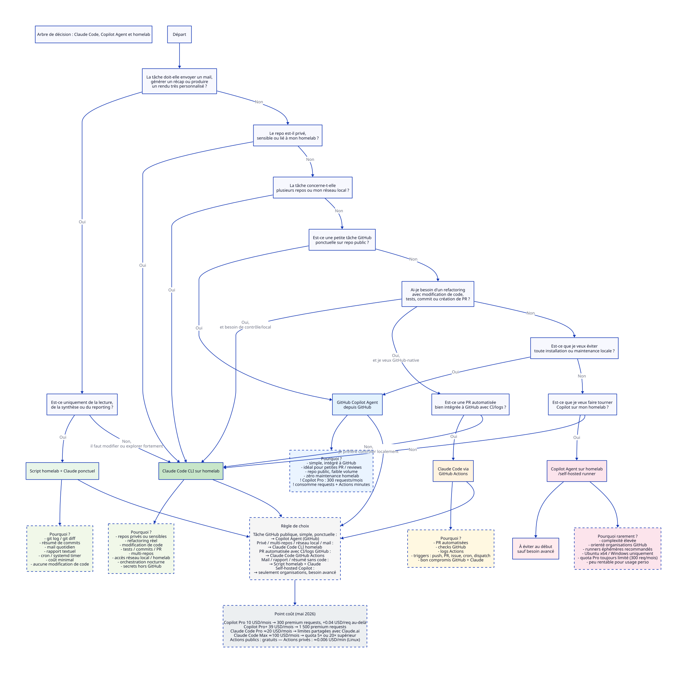

> Last verified pricing and limitations: **May 2026**

## Context

I have:

- a **GitHub Copilot Pro** subscription (not Pro+);
- a **Claude / Claude Code Pro** subscription (not Max);
- public and private repositories;
- varied needs:
  - code review;
  - repository analysis;
  - refactoring with PR creation;
  - sending recap emails.

## Decision diagram



---

## 1. Quick decision matrix

| Criterion | Homelab script + Claude | Claude Code CLI homelab | Copilot Agent (GitHub) | Claude Code via GitHub Actions | Copilot Agent self-hosted |
|---|---|---|---|---|---|
| **Private repos** | ✅ | ✅ | ⚠️ limited | ✅ | ✅ |
| **Public repos** | ✅ | ✅ | ✅ ideal | ✅ | ✅ |
| **Homelab / local network access** | ✅ | ✅ | ❌ | ❌ | ✅ if configured |
| **Multi-repo** | ✅ | ✅ | ❌ | ❌ | ❌ |
| **Code modification / PR** | ❌ | ✅ | ✅ | ✅ | ✅ |
| **Reading / summary / reporting** | ✅ ideal | ✅ | ⚠️ | ⚠️ | ⚠️ |
| **Email or custom report** | ✅ ideal | ✅ | ❌ | ❌ | ❌ |
| **GitHub CI/CD integration** | ❌ | ❌ | ✅ | ✅ native | ✅ |
| **Installation / maintenance** | Low | Moderate | None | Low | High |
| **Monthly cost** | Anthropic API (usage) | Claude subscription | Copilot Pro $10 | Claude subscription + Actions | Copilot Pro $10 + infra |

---

## 2. Detailed decision matrix

| Solution | Advantages | Disadvantages | Important limitations | Possible triggers | Estimated cost: occasional / regular use | Estimated cost: heavy use | Estimated cost: intensive use |
|---|---|---|---|---|---:|---:|---:|
| **Claude Code CLI on homelab** | Very flexible. Ideal for nightly scripts, emails, multi-repo work, custom prompts, local network access, private tasks. No need for GitHub Actions to run. Perfect for a night-shift workshop. | I have to maintain the VM/LXC, scripts, logs, tokens, permissions and security. Less plug-and-play than GitHub. | Claude limits are shared across Claude.ai, Claude Desktop and Claude Code. Limits depend on conversation length/complexity and the model. Standard context of **200K tokens** on non-Enterprise paid plans. Caution: if `ANTHROPIC_API_KEY` is set, Claude Code may use the API instead of my subscription, incurring a separate cost. | Manual, cron, systemd timer, webhook, commit, custom script, local pipeline, scheduled task, GitHub issue via script. | **€0** if included in my subscription and reasonable usage. | May need **extra usage**, a higher Claude plan, or the API if limits become a problem. | Likely needs pay-as-you-go API or a higher plan. On the Claude Sonnet 4.6 API: **$3/MTok input**, **$15/MTok output**. |
| **Claude Code via GitHub Actions** | Very good for "issue/prompt → branch → PR". Clean GitHub integration, logs in Actions, checks, review, history. Good for public repos or low-sensitivity private repos. | Less suited to daily emails, highly custom workflows, and homelab network access. For private repos, GitHub Actions can consume minutes. | Same Claude limit as the CLI if I use my Claude subscription. GitHub Actions is free on public repos with standard runners, but private repos consume included minutes and can then be billed. | Manual via `workflow_dispatch`, GitHub cron, PR, issue, comment, push/commit, label, schedule, workflow called by another workflow. | **€0** on a public repo with light Claude usage. On private: depends on Actions minutes + Claude limits. | Risk of Claude limits + private Actions minutes. | API or extra usage likely if high volume. Watch private Actions cost. |
| **GitHub Copilot Cloud Agent from GitHub** | The simplest option for native GitHub tasks: code review, small PR, issue assigned to Copilot, public repo. No homelab installation. Pleasant GitHub interface. | Less customizable than a homegrown orchestrator. Less suited to emails, multi-repo work, complex nightly jobs, local access. | Copilot Cloud Agent uses **GitHub Actions minutes + premium requests**. With Copilot Pro, I only get **300 premium requests/month**. The agent only modifies one repo per task, one branch at a time, and opens a single PR per task. Some branch protections/rulesets can block the agent. | Manual from GitHub, assigned issue, PR, comment, explicit request in the GitHub UI, code review tasks. | **€0** if I stay within the 300 requests and included minutes. | Possible overage: **$0.04/request** beyond the current quota. | Copilot Pro is probably too tight. Consider Pro+ or a credit model if usage grows. |
| **GitHub Copilot Agent on homelab / self-hosted runner** | Would allow using the GitHub/Copilot ecosystem while running on my own infra, with possible access to internal resources. | Much heavier. Runner setup, networking, security, ephemeral runners recommended. Less natural for simple personal use. | GitHub recommends ephemeral/single-use runners, often via ARC or a runner scale set. The Copilot cloud agent supports Ubuntu x64 and Windows 64-bit, not macOS/other OSes. Advanced configuration is mainly designed for GitHub organizations. | GitHub Actions, PR, issue, comment, label, schedule, workflow dispatch, standard GitHub triggers wired to the self-hosted runner. | Not very relevant for occasional/regular use. Time/complexity cost outweighs the benefit. | Only interesting if I have a GitHub organization and strong network constraints. | High operational complexity. Copilot Pro quota still capped at 300 requests/month. |
| **Homelab script without an agent, with occasional Claude** | Excellent for email reports, commit summaries, inventories, text audits. I keep Claude for synthesis, not for modifying code. Very economical. | Doesn't automatically produce complex PRs unless I add Claude Code or dedicated Git scripts. Less autonomous for modifying code intelligently. | Mostly depends on my scripts. Claude limits only apply if I request large or frequent summaries/analyses. | Manual, cron, systemd timer, commit, daily git log, webhook, local script, scheduled task, external event. | **€0** in most cases. | Can stay free if I limit the context sent. | May need the API for a high volume of long, multi-repo summaries. |

---

## 3. Matrix by need

| Need | Best choice | Why |
|---|---|---|
| **Text analysis of a private repo + custom recap email** | **Homelab script + Claude** or **Claude Code CLI homelab** | Private repo, customizable output, no PR needed, no need to spend Copilot requests or GitHub Actions. |
| **Daily commit summary for an Astro repo** | **Homelab script + optional Claude** | A `git log` + email summary is enough. A full agent would be overkill. |
| **Code review on a PR in a public repo, low volume** | **GitHub Copilot Cloud Agent** | Simple, integrated, no need to install infrastructure on my homelab. With few PRs, Copilot Pro is probably enough. |
| **Automatically creating a refactoring PR on a public repo** | **Copilot Cloud Agent** or **Claude Code GitHub Action** | GitHub is the natural place: branch, PR, checks, review. |
| **Automatically creating a security PR on a private homelab repo** | **Claude Code CLI homelab** | I can inject my conventions, IaC files, local context, and keep secrets out of GitHub Actions. |
| **Terraform/Ansible audit without touching real infra** | **Claude Code GitHub Action** or **Claude Code CLI homelab** | A GitHub Action is enough if everything is in Git. Homelab is better if I want to cross-check against local state. |
| **Terraform/Ansible audit + real Proxmox/network state** | **Claude Code CLI homelab** | GitHub must not hold the keys to my home. |
| **Nightly multi-repo refactoring** | **Claude Code CLI homelab** | Copilot Cloud Agent is limited to one repo per task, one branch, one PR. |
| **Small GitHub issue → PR task** | **Copilot Cloud Agent** | Simple, fast, already in GitHub. |
| **Highly custom workflow: sometimes a PR, sometimes an email, sometimes a Markdown report** | **Claude Code CLI homelab** | I control the outputs, prompts, rules, formats and orchestration. |
| **Need to run inside my local network** | **Claude Code CLI homelab** | Simpler and safer than exposing my network to GitHub. |
| **Avoid any homelab maintenance** | **Copilot Cloud Agent from GitHub** | Less powerful, but immediate. |
| **Avoid any extra cost** | **Homelab + occasional Claude**, then Copilot only for low volume | My Copilot Pro quota is limited, so I save it for cases where GitHub is genuinely useful. |

---

## 4. Difference between "Claude Code CLI homelab" and "homelab script + Claude"

These two options look similar because they both run on my homelab, but they don't address the same level of autonomy.

### Homelab script + Claude

In this model, the script does the mechanical work:

```text
git log
git diff
list of commits
reading targeted files
generating a raw report
sending the email
```

Claude only acts as a **synthesis engine** or **writer**.

Good fits:

```text
- summarizing the day's commits
- turning a git log into a readable email
- analyzing an existing README or report
- producing a weekly summary
- categorizing changes by theme
```

This is the right choice when I want:

```text
- low risk
- low cost
- a custom output
- no code modification
- no complex PR
```

### Claude Code CLI on homelab

In this model, Claude Code becomes a **local development agent**.

It can:

```text
- explore the repo
- read multiple files
- propose a plan
- modify code
- run commands
- run tests
- create commits
- prepare a PR via the GitHub CLI
```

This is the right choice when I want:

```text
- real refactoring
- code modification
- branch creation
- PR creation
- deeper repository analysis
- multi-repo orchestration
- a more autonomous nightly workflow
```

### Simple rule

| Situation | Choice |
|---|---|
| I just want to read, summarize, send an email | **Homelab script + Claude** |
| I want to modify code, test, commit, create a PR | **Claude Code CLI homelab** |
| I want a very reliable, deterministic job | **Homelab script** |
| I want an agent that can reason across the repo | **Claude Code CLI** |

---

## 5. Practical cost grid

The figures below are **decision-making orders of magnitude**, not a guaranteed bill.

| Usage level | Concrete description | Claude Code CLI homelab | Claude Code GitHub Actions | Copilot Cloud Agent with Copilot Pro |
|---|---|---:|---:|---:|
| **Occasional / regular** | 1 to 3 tasks/week, small repos, few changes, a few PRs/reviews | €0 | €0 on public; private depends on minutes | €0 if < 300 premium requests/month |
| **Heavy** | 1 task/day or several repos/week | Risk of hitting Claude Pro limits | Risk of Claude limits + private Actions minutes | Risk of exceeding 300 requests, then $0.04/request at the current model |
| **Intensive** | Nightly multi-repo runs, large refactors, many PRs | Claude Pro probably insufficient; consider extra usage/API/Max | Same, plus possible private Actions cost | Copilot Pro probably too tight; consider Pro+ or overage credits |

---

## 6. Specific limitations of Claude Code CLI on homelab

### 6.1 Claude usage limits

Claude Code on Pro/Max shares the same limits as Claude.ai, Claude Desktop and other Claude surfaces.

Consequence:

```text
A large overnight Claude Code session can reduce the Claude usage available to me the next morning.
```

So if I run several heavy jobs overnight, I might find myself limited afterwards for interactive use.

### 6.2 Limited context

Non-Enterprise paid plans have a standard context of **200K tokens**.

For a repo of **~50K lines**, this isn't a blocker if tasks are targeted, but it's not an invitation to have the whole repo read on every run.

Favor:

```text
- tasks targeted by folder
- precise prompts
- CLAUDE.md files
- using ripgrep
- git diff
- tree
- architecture README
- project conventions
```

Avoid:

```text
- "analyze the whole repo"
- "refactor the entire application"
- "read every file and suggest everything that could be improved"
```

### 6.3 Risk of unintended API billing

If `ANTHROPIC_API_KEY` is set in the runner's environment, Claude Code may use that API key instead of my Claude subscription.

Check on the runner:

```bash
env | grep ANTHROPIC
```

If I want to use only my subscription:

```bash
unset ANTHROPIC_API_KEY
```

If I want to deliberately use the API, I should put in place:

```text
- a monthly budget
- monitoring
- per-task logs
- a per-repo limit
- a limit per run type
```

### 6.4 Local security

Claude Code CLI on homelab is powerful because it's close to my resources. That's also its main risk.

Do not grant it, at least initially:

```text
- global SSH access
- admin GitHub tokens
- Proxmox secrets
- production .env files
- Ansible vault
- terraform.tfstate files
- write access to backups
- full access to my $HOME
```

Recommended architecture:

```text
dedicated VM/LXC
dedicated user
repos cloned under /srv/ai-runner/workspaces
restricted GitHub SSH key
no prod secrets
ai/* branches
PR required
CI required
timestamped logs
regular snapshots
```

### 6.5 Maintenance

Running Claude Code CLI locally means maintaining:

```text
- the VM/LXC OS
- Node/npm/pnpm for JS projects
- Terraform/Ansible for IaC
- GitHub CLI
- Claude Code CLI
- scripts
- cron/systemd timers
- logs
- token rotation
- snapshots
```

It's not huge, but it's not zero either.

---

## 7. What changes with Copilot Pro vs Copilot Pro+

With **Copilot Pro**, I currently have:

```text
300 premium requests / month
$0.04 per additional request
```

With **Copilot Pro+**, I would have:

```text
1,500 premium requests / month
```

So with my current subscription, Copilot Cloud Agent is very appealing for:

```text
- a few public PRs
- a few code reviews
- a few simple tasks
- small repos
- low frequency
```

But it becomes less obvious for:

```text
- daily tasks
- multiple repos
- large refactoring
- a nightly agent
- multi-iteration workflows
- combined Chat + review + agent usage
```

The Copilot Pro quota can be enough as an **occasional GitHub tool**, but not as the main engine of my nightly automation.

---

## 8. Simple decision rule

| Question | Answer | Choice |
|---|---|---|
| Is it a pure, small GitHub task on a public repo? | Yes | **Copilot Cloud Agent** |
| Is it private, multi-repo, email/reporting, or highly custom? | Yes | **Claude Code CLI homelab** |
| Is it an automated PR with clean CI on GitHub? | Yes | **Claude Code GitHub Action** or **Copilot Cloud Agent** |
| Does it need to access my local network? | Yes | **Homelab** |
| Do I want to avoid any installation? | Yes | **Copilot Cloud Agent** |
| Do I want to avoid Copilot Pro overages? | Yes | **Claude Code CLI homelab** |
| Is the repo private and sensitive? | Yes | **Claude Code CLI homelab** |
| Is it just a report or an email? | Yes | **Occasional homelab script + Claude** |

---

## 9. Sources

- GitHub Docs — Individual Copilot plans, Pro/Pro+ quotas and premium requests
  https://docs.github.com/en/copilot/concepts/billing/individual-plans

- GitHub Docs — Copilot coding agent (cloud)
  https://docs.github.com/en/copilot/concepts/agents/coding-agent/about-coding-agent

- GitHub Docs — GitHub Actions billing
  https://docs.github.com/en/billing/managing-billing-for-github-actions/about-billing-for-github-actions

- GitHub Docs — Configure a self-hosted runner for Copilot coding agent
  https://docs.github.com/en/copilot/how-tos/administer-copilot/manage-for-organization/configure-runner-for-coding-agent

- Anthropic Support — Using Claude Code with your Pro or Max plan
  https://support.claude.com/en/articles/11145838-use-claude-code-with-your-pro-or-max-plan

- Anthropic Support — How usage and length limits work
  https://support.claude.com/en/articles/11647753-how-do-usage-and-length-limits-work

- Anthropic Docs — Claude API pricing
  https://platform.claude.com/docs/en/about-claude/pricing
