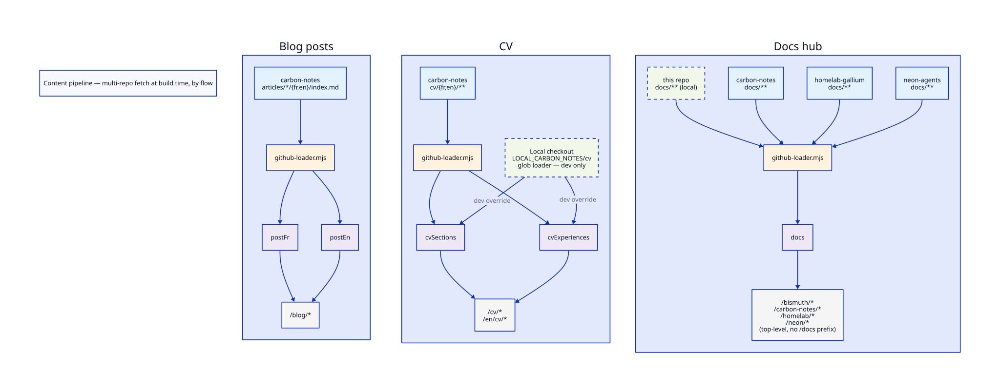

# Content Pipeline — multi-repo content fetching

## What this is

This repo holds almost no long-form content of its own outside `docs/` — `src/content/` only has the homepage bio and the `/docs` overview page. Blog articles, CV data, and aggregated documentation are fetched at **Astro build time** via a custom Content Layer loader: most of it from sibling repos, and — for the `docs` collection — also from this very repo's own `docs/` folder. There is no webhook and no ISR: a deployed build is a snapshot of all of that at the moment `astro build` ran.

## Sources

| Source | Provides | Path pattern | Collection(s) |
|---|---|---|---|
| This repo (`docs/`, local) | This repo's own technical docs | `docs/**/*.md` | `docs` (id prefix `bismuth/`) |
| `Trophalaxeur/carbon-notes` | Blog articles (fr/en) | `articles/*/{fr,en}/index.{md,mdx}` | `postFr`, `postEn` |
| `Trophalaxeur/carbon-notes` | CV content (fr/en) | `cv/{fr,en}/*.md`, `cv/{fr,en}/experiences/*.md` | `cvSections`, `cvExperiences` |
| `Trophalaxeur/carbon-notes` | General notes | `docs/**/*.md` | `docs` (id prefix `carbon-notes/`) |
| `Trophalaxeur/gallium-homelab` | Homelab infrastructure docs | `docs/**/*.md` | `docs` (id prefix `homelab/`) |
| `Trophalaxeur/neon-agents` | Neon agents docs | `docs/**/*.md` | `docs` (id prefix `neon/`) |

`carbon-notes` is the only remote repo that feeds three different collections — it's the personal knowledge base shared across every project (this blog, gallium-homelab, neon-agents). The `docs` collection itself aggregates **four** sources — this repo plus the other three's `docs/` folders — into one browsable site, treated as equals (see [Starlight integration](#starlight-integration-docs-collection-only) for how the routing actually works, it's not what the name suggests).

All collections are defined in `src/content.config.ts`; the actual fetching/reading logic lives in `src/loaders/github-loader.mjs`.

## Diagram



## How fetching works — `github-loader.mjs`

`githubLoader(sources)` is a custom [Astro Content Layer loader](https://docs.astro.build/en/reference/content-loader-reference/). It accepts one config object or an array of them (the `docs` collection uses four — one local, three remote). Each config takes:

| Option | Purpose |
|---|---|
| `repo` | `"owner/name"` GitHub repo (remote sources only) |
| `local` / `base` | `local: true` reads from disk instead of GitHub; `base` is the directory to read, relative to the repo root (local sources only) |
| `pathPattern` | glob matched against the source's file list (`**`, `*`, `{a,b}` supported) |
| `token` | GitHub token, see [Environment variables](#environment-variables) (remote sources only) |
| `stripPrefix` | removes a leading path segment before it becomes the entry id (remote sources only — `base` already does this job for local ones) |
| `idPrefix` | prepended to the id (e.g. `homelab/` → `homelab/getting-started`) |
| `stripExtension` | drops `.md`/`.mdx` from the id |
| `starlightDocsBase` | see [Starlight integration](#starlight-integration-docs-collection-only) |

For each source, on every build:

1. **List files** — remote sources call `GET /repos/{repo}/git/trees/{default_branch}?recursive=1`; local sources (`local: true`) walk `base` on disk instead. Either way, the result is filtered against `pathPattern`.
2. **Digest check** *(remote only)* — each matching file's git `sha` is compared against the digest already in the Content Layer store; unchanged files are skipped entirely, no fetch, no re-render. Local sources have no network round-trip to save, so they're always re-read and re-rendered.
3. **Content read** — remote: raw file fetched via `GET /repos/{repo}/contents/{path}`; local: read straight off disk. Frontmatter is parsed with `js-yaml` either way.
4. **Markdown pipeline** — body content runs through the same `unified`/remark/rehype pipeline regardless of source: strip a leading `h1` (Starlight renders the frontmatter `title` as its own `h1`), slug headings, collect `h2`/`h3` for the table of contents, rewrite relative links for Starlight's virtual directory routing, inline any linked `.d2` diagram as a compiled SVG, and — local sources only — copy any referenced image into `public/docs-assets/` and rewrite its `src` (see [Images in local docs](#images-in-local-docs)).
5. **Store** — the rendered entry is written to the Content Layer store, keyed by id.

If a remote source's `token` is missing, the loader logs a warning and **skips that source** — the build still succeeds, the affected pages just render with no entries. See the README's Troubleshooting section.

## Local development override — `LOCAL_CARBON_NOTES`

Editing CV content means iterating on markdown in a local carbon-notes checkout. Round-tripping every edit through the GitHub API (and needing a token at all) is unnecessary friction for that loop, so `cvSections`/`cvExperiences` support a dev-only bypass — unrelated to the `local: true` mechanism above, this one swaps in Astro's own built-in loader instead:

```ts
// src/content.config.ts
const cvExperiences = defineCollection({
  loader: LOCAL_CARBON_NOTES
    ? glob({ pattern: '{fr,en}/experiences/*.md', base: `${LOCAL_CARBON_NOTES}/cv` })
    : githubLoader({ repo: CARBON_NOTES, pathPattern: 'cv/{fr,en}/experiences/*.md', token: CONTENT_TOKEN, stripPrefix: 'cv/' }),
  // ...
});
```

When `LOCAL_CARBON_NOTES` is set to an absolute path, Astro's built-in `glob()` loader reads `${LOCAL_CARBON_NOTES}/cv` directly off disk instead of calling GitHub — no token needed, instant reloads, and it gets Astro's native file-watching for free during `astro dev` (the custom loader's `local: true` sources don't: editing `docs/*.md` needs a dev-server restart to pick up).

This override only exists for the two CV collections. `postFr`, `postEn`, and the three remote `docs` sources always fetch from GitHub regardless of `LOCAL_CARBON_NOTES`.

### Sub-selector — `TAILORED_CV_SLUG`

A second dev-only env var, `TAILORED_CV_SLUG`, re-points the same two collections one level deeper: instead of `${LOCAL_CARBON_NOTES}/cv`, they read `${LOCAL_CARBON_NOTES}/cv/tailored/<slug>`. It only has any effect when `LOCAL_CARBON_NOTES` is also set — it's a sub-selector of that mechanism, not an independent one — and it's gated behind `import.meta.env.DEV` exactly the same way, for the exact same reason: Vite statically replaces that check to `false` at build time, so a production build never even reads the variable's value.

This exists for `bromine-backend` (see `Trophalaxeur/bromine-backend`), which generates one-off, AI-tailored CVs (adapted to a specific job offer, or a custom prompt) on demand. It spawns `astro dev` in a bismuth-blog checkout with `TAILORED_CV_SLUG` set to render exactly one tailored dataset — living at `carbon-notes/cv/tailored/<slug>/{fr,en}/` and mirroring `cv/{fr,en}/`'s shape exactly (same frontmatter schema, same file layout, prefix included) — to a PDF via Playwright, then tears the dev server down. See [docs/cv/pdf-generation-tailored.md](./cv/pdf-generation-tailored.md) for the full flow.

The route that renders this content, `src/pages/cv/tailored/[slug]/print.astro`, has its own `getStaticPaths()` returning `[]` whenever `!import.meta.env.DEV` — so even independently of `TAILORED_CV_SLUG` never being read in a build, the route itself is absent from `dist/` in production (verified: an empty `getStaticPaths()` on a dynamic route under `output: 'static'` builds clean, with zero pages emitted, no error). `middleware.ts` and the sitemap filter both also exclude `/cv/tailored/*` as further defense in depth.

**Cache warning**: because `astro dev`'s content loaders all run on startup — articles, docs, not just the CV — the Astro Content Layer cache (`.astro/`) in whatever bismuth-blog checkout is running this must persist between renders (a fresh checkout, or one with `.astro/` wiped, re-fetches everything from GitHub on the very next render, which is slow and needs `CONTENT_TOKEN`).

## Starlight integration (`docs` collection only)

The `docs` collection feeds an [`@astrojs/starlight`](https://starlight.astro.build/) site. **Despite the name, it is not mounted under a `/docs` URL prefix** — Starlight's `base` is the site root, so its pages land at top-level routes: `/bismuth/content-pipeline`, `/carbon-notes/architecture`, `/homelab/adguard-config`, `/neon/agents`, etc. `/docs` itself is just a separate, hand-written overview page (`src/pages/docs.astro`, prose in `src/content/docs-home.md`) that links out to each section below — it only shares the word "docs" by coincidence.

Four sources share that flat namespace, each with a distinct `idPrefix` matching the sidebar's `autogenerate` directories in `astro.config.mjs`: `bismuth/` (this repo, local), `carbon-notes/`, `homelab/`, `neon/`.

Starlight's sidebar autogenerate needs a `filePath` per entry to derive its group — these entries don't exist on disk as actual Starlight content files (they were fetched from GitHub, or read from this repo's `docs/` rather than `src/content/docs/`), so the loader fabricates one: `starlightDocsBase + '/' + id + '.md'` (e.g. `src/content/docs/homelab/getting-started.md`). Starlight only uses the string for path operations; the file is never read. Full rationale: `carbon-notes/docs/decisions/starlight-content-layer-integration.md` (itself fetched into this same `docs` collection, browsable at `/carbon-notes/decisions/starlight-content-layer-integration`).

A markdown link pointing at a relative `.d2` file is fetched/read from the same source and compiled to inline SVG automatically — this lets a D2 diagram linked from any of the four sources render on the live site with **no manual export step**.

### Images in local docs

A plain markdown image pointing at a relative raster/SVG file (used in this repo's own docs, e.g. `ai-agent-decision-tree/`) works differently from a `.d2` link: there's no inlining, the image needs to be served as an actual static file, and a relative path has no meaningful base once the content is rendered into a virtual Starlight route. For `local: true` sources, the loader copies every referenced image into `public/docs-assets/<same relative path>` and rewrites the markdown's image path to the matching absolute `/docs-assets/...` path before rendering.

`public/docs-assets/` is regenerated on every build/dev run and gitignored — the only canonical copy of an image lives next to its source markdown under `docs/`. This mechanism is local-only; none of the three remote sources currently embed plain images (they use `.d2` links instead, which the loader already inlines without a separate copy step).

## Adding a new source

1. **Local** (content already lives in this repo): add `{ local: true, base: '...', pathPattern: '...', idPrefix: '...', stripExtension: true, starlightDocsBase: 'src/content/docs' }` to the relevant `githubLoader([...])` array.
2. **Remote**: make sure the GitHub token in `CONTENT_TOKEN` has `Contents: Read-only` on the new repo (fine-grained PATs are scoped per-repo), then add a `{ repo, pathPattern, token: CONTENT_TOKEN, ... }` config the same way.
3. Pick `idPrefix` carefully if it lands in the shared `docs` collection — collisions silently overwrite the earlier entry in the Content Layer store.
4. Run `npm run build` and check the `Fetching tree: …` / `Reading local docs: …` and `N files match …` log lines to confirm it picked up the new source.

## Regenerating the diagram

```bash
d2 docs/content-pipeline.d2 docs/content-pipeline.svg
d2 docs/content-pipeline.d2 docs/content-pipeline.png
```

## See also

- [docs/cv/pdf-generation.md](./cv/pdf-generation.md) — what happens downstream of `cvSections`/`cvExperiences` to produce the CV PDFs
- [docs/cv/pdf-generation-tailored.md](./cv/pdf-generation-tailored.md) — the on-demand, AI-tailored variant of that pipeline (driven by `bromine-backend`)
- README → [Linked projects](../README.md#linked-projects) and [Troubleshooting](../README.md#troubleshooting)
