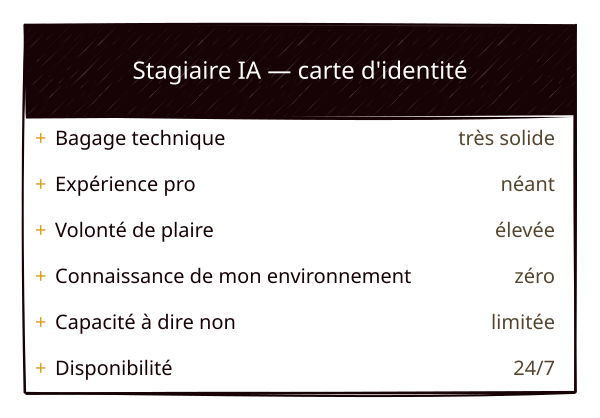
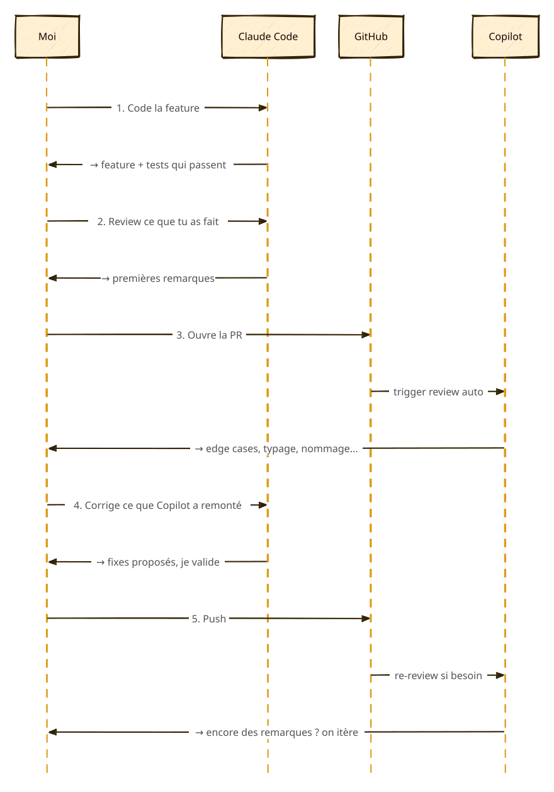

On entend partout que l'IA fait gagner du temps. C'est vrai. Souvent. Quand le contexte est bien fourni, le résultat attendu clair, et l'outil pas trop libre dans son interprétation du besoin.

Mais à force de l'utiliser pour écrire, coder, déployer, raffiner mon CV, choisir une stack ou générer des visuels, je ne pense plus que le gain de temps soit son unique point fort.

La vision que j'en ai aujourd'hui est celle d'un stagiaire avec un énorme bagage technique, zéro expérience pro, et une tendance à vouloir trop faire plaisir. C'est un stagiaire qui a tout lu, qui produit vite, qui sait parler de tout — mais à qui il faut expliquer comment fonctionne le travail en équipe, à qui il faut décrire son environnement, les conventions de l'équipe, les pièges spécifiques au projet. Et qui aura toujours tendance à valider plutôt qu'à contredire. Sans cadre, il fonce. Avec un bon cadre et un peu de méfiance bienveillante, il devient un vrai levier.

> [!NOTE]
> **TL;DR —** ce que ces dernières semaines m'ont apporté :
> - **Coût d'entrée plus faible** sur des sujets jamais attaqués seul
> - **Culture technique** qui s'épaissit sans devenir expertise
> - **Qualité de livrable** meilleure grâce aux revues croisées Claude / Copilot
> - **Solutions plus pérennes**, parce que l'IA challenge ce que je minimise en solo
>
> **L'IA peut me faire aller plus vite. Ou me faire faire mieux en autant de temps.**

Ce post est un retour sur six apprentissages tirés de ces dernières semaines — et sur ce que ça a fini par changer dans ma façon de travailler.

## 1. Une IA répond au contexte, pas à l'intention cachée

Mon premier exemple : choisir une stack pour ce blog. Après une première recherche sur ChatGPT pour explorer mes possibilités, mon choix s'est limité à deux options : Hugo ou Astro ? La question paraissait simple. Elle ne l'était pas.

J'ai commencé avec un contexte minimal et quelques contraintes : documenter mon homelab, publier des retours d'expérience, intégrer mon CV, garder du Markdown, rester simple et automatisable. Première réponse de l'IA : **Hugo**. Logique — rapide, orienté contenu, zéro friction.

Puis j'ai ajouté une contrainte : rendu moderne, sans avoir à faire le design moi-même. Bascule vers **Astro**. Plus flexible, plus de potentiel "vitrine".

J'ai resserré : budget serré, thèmes gratuits, zéro effort. Retour vers **Hugo**. Plus de thèmes plug & play.

Enfin, j'ai précisé que je voulais un site unique combinant CV, blog et image professionnelle. Retour vers **Astro**, plus cohérent pour cet usage hybride.

Ce qui m'a marqué, ce n'est pas le choix final (Astro, évidemment). C'est que l'IA n'avait pas changé d'avis : elle répondait à chaque modification successive du contexte. Mon problème s'était précisé.

> [!NOTE]
> Petit bonus de fin de partie : le thème qu'elle m'avait recommandé n'était plus compatible avec la version courante d'Astro. Une IA peut produire une réponse cohérente, élégante, argumentée — et techniquement périmée. Les versions, c'est un point sur lequel il faut rester attentif.

L'enseignement que j'en tire : il faut donner dès le départ les **contraintes dures**, celles qui ne sont pas négociables (budget, architecture, besoin, etc.). Les contraintes plus souples peuvent être ajoutées en cours de discussion — l'IA peut d'ailleurs aider à les découvrir. Dans mon cas, le déploiement n'était pas dans mes critères initiaux : c'est dans un de ses tableaux comparatifs que l'idée a remonté, et elle avait raison de l'avoir fait.

## 2. Une IA technique doit être briefée comme un collègue

Côté assistance technique, j'ai pris ma première claque sur un problème réseau bête.

Un de mes services n'était plus joignable via son DNS. J'ai ouvert Claude Code dans le terminal, expliqué le symptôme, donné les erreurs que j'avais sous la main, et laissé l'IA me guider. Elle m'a proposé une série de commandes sur `wlan0` — vérifier la connexion Wi-Fi, redémarrer l'interface, regarder iwd. Tout était cohérent. Tout était inutile : j'étais branché en Ethernet sur `enp57s0u2u4`, le Wi-Fi n'était même pas actif. Les commandes proposées n'auraient rien corrigé, et certaines auraient pu rendre les choses plus bancales (en modifiant des configurations de services réseau qui marchaient très bien par exemple).

Mon erreur ? Je n'avais jamais précisé que j'étais en Ethernet. Pour Claude Code, je raconte un problème réseau sur Arch — l'hypothèse statistiquement la plus probable, c'est Wi-Fi. Un humain aurait commencé par poser la question. L'IA, elle, a tranché silencieusement.

> [!TIP]
> Un humain n'aurait pas besoin de tout ça. Un humain aurait juste demandé "tu es branché en Wi-Fi ou en Ethernet ?". Mais l'IA ne pose pas la question — donc il faut anticiper.

Depuis, je documente le contexte immuable dans mes fichiers `CLAUDE.md` — un fichier global avec mes préférences et mon environnement (interfaces réseau, OS, shell, conventions), un par projet avec les spécificités. C'est l'une des habitudes que j'avais commencé à poser dès [mes premiers pas sur le homelab](/blog/homelab-01-first-steps), et qui a tenu depuis.

## 3. ...mais pas surveillée par-dessus l'épaule

Au début, je relisais chaque commande avant de la laisser tourner. C'était une posture d'apprentissage pour moi mais aussi de surveillance — celle qu'on n'aurait jamais avec un collègue, ni même avec un stagiaire. Avec un humain, on regarde le résultat après coup, pas chaque ligne au moment où il la tape.

Je me dirige plutôt vers ça : découper une grosse tâche en sous-tâches plus petites, laisser l'IA autonome sur chacune, et ne contrôler que le résultat. Un gros refacto devient une suite de petits refactos vérifiables. Et chaque sous-tâche devient un point de rendez-vous où je peux recadrer si l'IA part en cacahuète. Sur une grosse tâche lâchée sans supervision, on ne voit pas qu'elle dérape — quand on s'en aperçoit, on est déjà loin du chemin prévu.

Le vrai changement est là : passer du contrôle ligne à ligne à un contrôle par étapes, par test, par résultat.

## 4. L'IA améliore la qualité, pas seulement la vitesse

C'est probablement le point le plus surprenant : sur beaucoup de sujets, l'IA ne m'a pas fait gagner de temps. Elle m'en a même parfois fait perdre. Mais le résultat final était meilleur que ce que j'aurais produit seul.

Sur le code, j'ai fini par formaliser une boucle de qualité qui repose sur deux IA différentes :

1. Je code avec **Claude Code**.
2. Une fois la fonctionnalité testée, je demande à Claude une première série de revues — une à plusieurs passes selon la complexité du sujet.
3. Je crée la PR.
4. **GitHub Copilot** fait sa propre review automatique sur la PR.
5. Claude corrige ce que Copilot a remonté, je valide les fixes.
6. Si Copilot revient avec d'autres remarques, j'itère encore.

C'est coûteux en temps (et en tokens). Une PR qui pourrait être mergée en trente minutes peut me prendre deux heures avec ce process. Mais le delta de qualité est réel : Copilot remonte régulièrement des choses que Claude n'avait pas vues — edge cases, incohérences de typage subtiles, gestion d'erreur oubliée, problèmes de nommage (dommage qu'il ne remonte pas tout en une fois et qu'il faille parfois plusieurs passes pour voir tous les problèmes). Et inversement, Claude attrape parfois des choses que Copilot laisse passer.

> [!NOTE]
> Ce sont deux relecteurs différents avec la même formation et des angles d'attaque distincts. Sur du code, deux paires d'yeux indépendantes valent toujours mieux qu'une — même quand les deux paires sont artificielles.

Ce pattern marche au-delà du code. Sur un post de blog, une décision technique, un CV, l'IA me sert à me challenger. Elle me force à reformuler, à distinguer ce qui est essentiel de ce qui est confortable. Le résultat n'arrive pas plus vite. Il arrive plus précis.

## 5. L'IA approfondit un sujet — et m'en a ouvert plusieurs

C'est le point que j'aurais le plus de mal à mesurer en KPI, mais celui qui a probablement le plus changé ce que je m'autorise à entreprendre.

Avant, le DevOps était un domaine que je maîtrisais sans plus. J'avais toujours eu envie de monter un homelab, mais la marche d'entrée me semblait trop haute pour le gain perçu — un weekend pour configurer Proxmox, un autre pour Terraform, un autre pour Ansible, un autre pour tout déboguer… et après seulement, commencer à déployer quelque chose d'utile. Du coup je ne m'étais jamais lancé.

Aujourd'hui, j'ai un Proxmox qui tourne chez moi, du Terraform pour provisionner les VMs, de l'Ansible pour déployer les services, et ce blog qui documente l'aventure. Ce qui a changé n'est pas que l'IA fait à ma place. C'est qu'elle abaisse le **coût d'entrée** d'un sujet inconnu. Pas l'effort total — le coût d'entrée. Le travail est toujours là, mais le moment où on bloque arrive plus tard, et il est plus précis.

> [!TIP]
> Je ne suis pas devenu expert en infra. Mais j'ai acquis de la culture technique. Je sais poser de meilleures questions, je vois mieux les compromis, je comprends pourquoi un choix est adapté ici et mauvais là.

C'est une valeur moins spectaculaire que "j'ai déployé un cluster K8s en un weekend". Mais elle est plus durable. Quand je demande à Claude Code d'expliquer un choix, ce n'est pas seulement pour vérifier qu'il ne raconte pas n'importe quoi (même si c'est aussi pour ça). C'est pour apprendre — comprendre pourquoi, voir les alternatives, et me construire une carte mentale du domaine.

Une utilisation de l'IA intéressante : pas uniquement comme générateur, mais aussi comme outil de réflexion. Et accessoirement, comme un sas qui m'a fait passer de "j'aimerais bien faire ça un jour" à "c'est en cours".

## 6. Chaque interaction a besoin d'un cadre différent

Au fil des mois, j'ai arrêté de chercher l'outil unique. J'ai construit une répartition — pas par spécialité objective des modèles, mais par préférences personnelles et adéquations à mon workflow.

### ChatGPT pour les sujets textuels et le dégrossissage

C'est mon premier réflexe pour réfléchir à un sujet, structurer une idée, transformer un vrac de notes en plan, ou explorer une question sans contrainte technique forte.

Deux raisons, et aucune ne tient à la qualité absolue du modèle :

- **Claude est ma ressource la plus rationnée.** Mon quota part vite quand je code, et chaque token économisé sur du texte est un token disponible pour du code.
- **J'aime la façon dont ChatGPT répond** sur ces sujets. Le ton, la structure des réponses, sa capacité à proposer plusieurs angles sans en imposer un. Pure préférence personnelle, mais assumée.

### Claude pour tout ce qui touche au système

Mon poste, mon serveur, mes outils, le code associé. Claude Code dans le terminal, mes agents persos branchés sur l'API Claude.

Ce n'est pas qu'il code mieux que les autres dans l'absolu — c'est qu'il s'intègre mieux à mon environnement. Le CLI, la lecture de fichiers, l'exécution de commandes, le suivi de contexte via `CLAUDE.md` : c'est cette intégration qui fait la différence pratique. Un autre modèle au même niveau brut, sans cet outillage, me serait moins utile.

### GitHub Copilot pour la revue de code

Sur les reviews de PR, je trouve Copilot systématiquement plus rigoureux que Claude. Il remonte des choses que Claude n'a pas vues (l'inverse est vrai aussi, mais pas autant). C'est peut-être juste une impression personnelle, mais je dirais que les erreurs remontées par Copilot sont plus poussées techniquement, là où Claude a plus de contexte lié à mon environnement de travail. Copilot manque parfois de vision métier, Claude manque parfois de profondeur technique pure — les deux se complètent assez bien.

### La photo du problème — usage transverse

Un usage qui ne dépend pas d'un outil particulier : prendre en photo l'écran d'une install qui ne passe pas, ou un message d'erreur de boot, et le balancer à l'IA. Je l'ai fait avec Claude.ai, avec ChatGPT, selon ce que j'avais sous la main. Quand on bidouille un Arch Linux et que ça finit régulièrement par un kernel panic ou un réseau au tapis, c'est devenu un réflexe — et ça marche très bien quel que soit l'outil.

### Mon nemesis : l'art et les images

Pour la génération d'images, je n'ai pas trouvé mon arbitrage. Selon ce que j'ai sous la main, je pars sur Gemini, ChatGPT ou Canvas, voire même des outils plus spécialisés. Et j'en ressors toujours insatisfait. Les visuels isolés, ça peut aller. Mais si en plus il faut une cohérence dans le temps — un logo qui se décline, une palette, une identité, des icônes — je galère. Les modèles "oublient" les contraintes d'une génération à l'autre, modifient des éléments hors-scope, ou produisent des variations qui n'ont rien à voir.

C'est un apprentissage à part entière : trouver les bons cadres pour la génération visuelle. Pour l'instant, je n'y suis pas.

## Ce que je fais aujourd'hui

Concrètement, voici ce qui est ressorti de ces premières semaines :

- **Je pose les contraintes dures dès le début** — celles qui ne sont pas négociables (framework imposé, budget plafonné, format de livrable). Les contraintes plus souples, je les ajoute au fil du dialogue.
- **Je challenge les réponses systématiquement** : pourquoi cette option, quelles alternatives, qu'est-ce qui pourrait casser, qu'est-ce qu'il faudrait vérifier.
- **Je vérifie ce qui peut être obsolète** : versions de framework, compatibilité de thème, tarifs, API. C'est là que l'IA se trompe le plus discrètement.
- **Je maintiens des `CLAUDE.md`** (global + projet) pour le contexte stable.
- **Je demande un bilan de session quand j'ai galéré** — quand j'ai dû itérer beaucoup pour obtenir quelque chose que je pensais rapide. Au début je le faisais à chaque session, mais c'est devenu redondant une fois la méthode rodée.
- **Je formalise les patterns qui se répètent**. Quand un type d'échange marche plusieurs fois — review d'un ticket, génération d'un post, audit d'une PR — j'en fais un prompt spécialisé, un skill, ou un agent. L'idée n'est pas d'automatiser pour automatiser, mais d'éviter de réinventer la même méthode tous les trois jours.

## Et ensuite ?

Le prochain chantier est dans la continuité du dernier point : monter des **skills spécialisés** pour réduire le nombre d'échanges nécessaires à un résultat. Moins de "comprends d'abord ce que je veux", plus de "voici ce que je veux, fais-le".

J'ai déjà quelques JeanMichel en place — un reviewer, un auditeur, un blogueur (celui qui a relu ce post, en fait). L'idée à terme : une petite équipe de spécialistes, chacun avec son périmètre, ses règles, son output attendu. Pas pour automatiser au sens fort, mais pour ne plus réexpliquer la même méthode tous les trois jours.

## Fin de journée

Au final, le gain de temps n'est pas le point fort. C'est même presque devenu un sujet secondaire dans ma tête.

Ce que ces quelques semaines m'ont vraiment apporté :

- **Un coût d'entrée plus faible** sur les chantiers que je n'aurais pas attaqués seul. Le homelab, l'IaC, le DevOps avancé — pas par incompétence, mais par un calcul coût/bénéfice qui me freinait avant.
- **Une culture technique qui s'épaissit** autour des domaines que je creuse. Je ne deviens pas expert, mais j'ai assez de carte mentale pour avancer sans être aveugle.
- **Une qualité de livrable supérieure**, surtout grâce aux revues croisées entre Claude et Copilot. Ce que je perds en temps, je le récupère en bugs évités et en code mieux structuré.
- **Des solutions plus pérennes**, parce que l'IA me challenge, me remet en question, me pointe les sujets difficiles que j'aurais minimisés en solo.

Quand le sujet m'est déjà familier, le gain de temps est réel — sans doute parce que je sais ce que je veux et ce que j'attends. Sur du neuf ou du complexe, l'IA ne me fait pas aller plus vite. Elle me fait aller plus loin.

> L'IA peut me faire aller plus vite. Ou me faire faire mieux en autant de temps.
